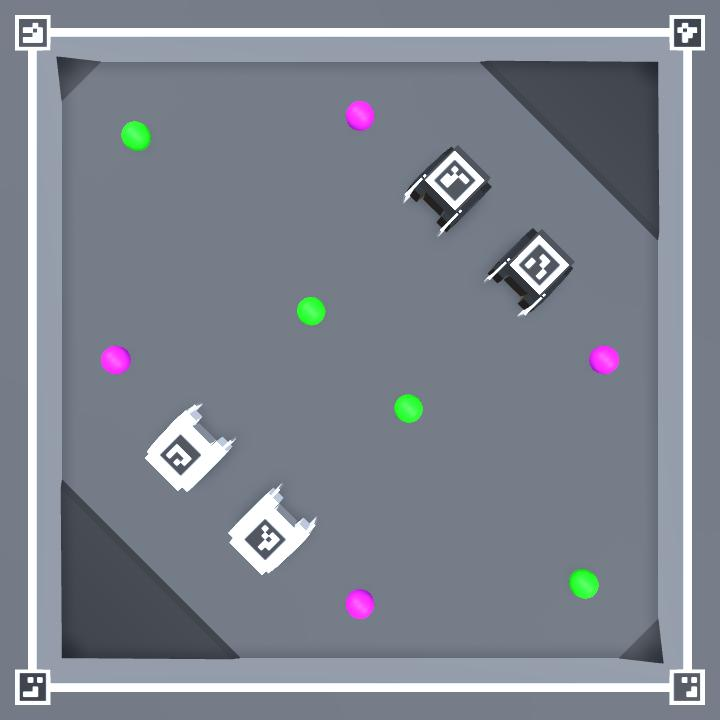

# Zero Ones Simulated
A simple simulator for a robot arena inspired by the [Robot Uprising Micro Invaders competition](https://robotuprising.fi/hackathon/hackathon-microinvaders/). If you're interested in training a machine learning model on a similiar arena, take a look at the official [Micro Invaders AI Simulator](https://github.com/robot-uprising-hq/ai-simulator).

## Quickstart
- You can use one of the [pre built binaries](https://github.com/zero-ones-given/zero-ones-simulated/releases) (Windows, MacOS, Linux)
- Alternatively you can build and run the Unity project
    - Double click the `MainScene` from the editor (assets/scenes/MainScene)
    - If you run the project straight from the Unity editor, make sure to select 720x720 (or the resolution you've confiugred in the [configuration.json](configuration.json)) as your resolution
    - The built version expects a [configuration.json](configuration.json) file and a folder called Images in the same folder as the binary. You can copy them to the build folder from the root of the project.
- Once the simulator is running, you can get the overhead video feed (in [MJPEG format](https://en.wikipedia.org/wiki/Motion_JPEG)) from: [http://localhost:8080](http://localhost:8080)
    - On some systems the standalone version can't output video while the Unity project is open



- You can control one of the robots with your keyboard (this is enabled in the default configuration for testing purposes)
- You can control another robot by sending semicolon delimited string of motor values as UDP packets to localhost port 3001 or 3002
    - The values shoud be between 100 and -100
    - It's a good idea to abstract sending commands in your codebase. We've been experimenting using bluetooth for controlling the robots with promising results and might switch over to bluetooth alltogether.
- You can change the starting positions and control methods by editing the [configuration.json](configuration.json)

To test out controlling the robot via UDP you can for example use the following command (Windows does not have netcat by default)
```
echo -n '100;-100' | nc -u 127.0.0.1 3002
```
Or in Python:
```
import socket
sock = socket.socket(socket.AF_INET, socket.SOCK_DGRAM)
sock.sendto(bytes("100;-100", "utf-8"), ("127.0.0.1", 3001))
```

## Resetting the simulation
You can reset the simulation by pressing the `q` key or by sending the command `reset` via UDP to the `controlPort` defined in the configuration (3000 by default). For example in Python you could do this:
```
import socket
sock = socket.socket(socket.AF_INET, socket.SOCK_DGRAM)
sock.sendto(bytes("reset", "utf-8"), ("127.0.0.1", 3000))
```

## Manipulating object locations
You can drag and drop objects around. Left mouse button drags the object and right mouse button points the highlighted object towards the cursor.

## Saving and loading
You can save the current object positions in [configuration.json](configuration.json) file by pressing `ctrl + s` or `cmd + s`. The previous configuration will be overridden.
You can load saved positions from [configuration.json](configuration.json) by pressing `ctrl + o` or `cmd + o`.
When running from the Unity editor you can press `ctrl + shif + o` instead to prevent the editor from stealing the keypress.

On MacOS when using the pre built binaries App Translocation may prevent loading or saving the configuration. This is also why the configuration file was moved inside the .app folder. You can still edit it by right clicking the .app and selecting Show Package Contents.

## Reading the video stream
The video stream can be read by any client that supports MJPEG. For example in Python you could do this with OpenCV:
```
import cv2
capture = cv2.VideoCapture("http://localhost:8080")
ret, frame = capture.read()
```

Aruco markers are placed on the robots and at the corners of the arena. This way you can correct for camera misalignment or compensate for perspective if the camera is not directly overhead. The arena corner markers have the following IDs and layout:
- **Top:** left: 46, right: 47
- **Bottom:** left: 48, right: 49

Note that version 0.0.6 used partially different IDs in a different order.

A python example of how to apply perspective transformations based on aruco markers at the arena corners [can be found here](https://github.com/zero-ones-given/perspective-correction-example).

## Configuration
Once you've built the project, you can use the [configuration.json](configuration.json) file to change the configuration without the need to rebuild the project. All the units are metric and the coordinate system is left-handed (Unity uses a left handed coordinate system). On the pre-built MacOS version the configuration file and images folder is inside Zero-Ones-Simulated.app. You can access them by right clicking the app and selecting "Show Package Contents".

| Option           | Type    | Notes |
| ---------------- | ------- | ----- |
| quality          | integer | The Unity graphics [quality level](https://docs.unity3d.com/ScriptReference/QualitySettings.SetQualityLevel.html)
| timeScale        | float   | Can be set to e.g. `1.5` if you want to simulate faster than real time
| controlPort      | integer | This port will listen to commands such as `reset` to reset the simulation
| streamFPS        | integer | The target FPS for the video stream. On a slow system you probably want to go lower than the default 25. The process of capturing and encoding frames is quite slow at the moment so trying to get over 30 might not be a good idea even on faster systems. The FPS limit is not set very precisely. In certain situations you may get a higher FPS than the set value.
| streamResolution | integer | The resolution of the simulation stream (and window). The same resolution will be used for width and height
| streamPort       | integer | The port for the video stream
| cameraOffset     | array   | A list of six floating point numbers in the following order: x offset, y offset, z offset, x angle, y angle and z angle in degrees. This affects the overhead stream camera and can be used to test camera misalignment. An example of a slightly misaligned camera: `[0.13, 0, 0.02, -3.4, 1.3, 0]` or camera at the side of the arena: `[1, 0, 0, -27, 0, 0]`
| robots           | array   | A list of robot objects
| dynamicObjects   | array   | A list of balls or obstacles

### Robot object
Robot objects have the following properties

| Option           | Type    | Notes |
| ---------------- | ------- | ----- |
| marker           | string  | Relative path to an image file that will be displayed on top of the robot
| color            | string  | A hexadecimal color code
| control          | string  | One of the following: `arrows`, `wasd`, `udp:3001` (the port can be any available port)
| position         | array   | A list of three floating point numbers and an optional integer in the following order: x, y, z, angle in degrees

### Dynamic object
Dynamic objects have the following properties

| Option           | Type    | Notes |
| ---------------- | ------- | ----- |
| type             | string  | One of the following: `ball`, `flickering-ball`, `ghost-ball`, `cube`, `traffic-cone`
| color            | string  | A hexadecimal color code
| position         | array   | A list of three floating point numbers and an optional integer in the following order: x, y, z, angle in degrees
| mass             | float   | Mass in kg
| size             | float   | The size of the object in meters
| value            | integer | The value given for delivering the object to a goal

## Debugging
You can find the logs that the simulator outputs here:
- Mac: ~/Library/Logs/Zero Oness Given/Zero Ones Simulated/Player.log
- Linux: ~/.config/unity3d/Zero Oness Given/Zero Ones Simulated/Player.log
- Windows: C:\Users\username\AppData\LocalLow\Zero Oness Given\Zero Ones Simulated\Player.log

### Running a downloaded binary
You may see warnings of the binary being from an unidentified source. This is expected since we have not signed it. On MacOs something called App Translocation may also occur, where the application file is moved to a random location before execution as a safety precaution. This may break loading and saving the configuration.
