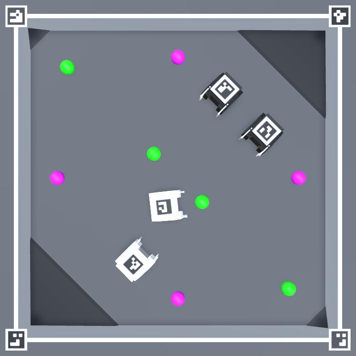

# Zero Ones Simulated
A simple simulator for a robot arena

## Quickstart
- You can use one of the [pre built binaries](https://github.com/zero-ones-given/zero-ones-simulated/releases) (Windows, MacOS, Linux)
- Alternatively you can build and run the Unity project
    - select the `MainScene` from the editor
    - If you run the project straight from the Unity editor, make sure to select 720x720 (or the resolution you've confiugred in the configuration.json) as your resolution
    - The built version expects a configuration.json and Images folder in the same folder as the binary. You can copy them to the build folder from the root of the project.
    - On MacOS the configuration.json relative image paths should be in the format: "../../Images/aruco-0.png" when the project is run from the built binary.
- Once the simulator is running, you can get the overhead video feed (in [MJPEG format](https://en.wikipedia.org/wiki/Motion_JPEG)) from: [http://localhost:8080](http://localhost:8080)



- You can control one of the robots with your keyboard (this is enabled in the default configuration for testing purposes)
- You can control another robot by sending semicolon delimited string of motor values as UDP packets to localhost port 3001 or 3002
    - The values shoud be between 100 and -100
- You can change the starting positions and control methods by editing the configuration.json

To test out controlling the robot via UDP you can for example use the following command
```
echo -n '100;-100' | nc -u 127.0.0.1 3002
```
Or in Python:
```
import socket
sock = socket.socket(socket.AF_INET, socket.SOCK_DGRAM)
sock.sendto(bytes("100;-100", "utf-8"), ("127.0.0.1", 3001))
```

## Configuration
Once you've built the project, you can use the configuration.json file to change the configuration without the need to rebuild the project. All the units are metric.

| Option           | Type    | Notes |
| ---------------- | ------- | ----- |
| quality          | integer | The Unity graphics [quality level](https://docs.unity3d.com/ScriptReference/QualitySettings.SetQualityLevel.html)
| timeScale        | float   | Can be set to e.g. `1.5` if you want to simulate faster than real time
| controlPort      | integer | This port will listen to commands such as `reset` to reset the simulation
| streamFPS        | integer | The target FPS for the video stream. On a slow system you probably want to go lower than the default 25. The process of capturing and encoding frames is quite slow at the moment so trying to get over 30 might not be a good idea even on faster systems. The FPS limit is not set very precisely. In certain situations you may get a higher FPS than the set value.
| streamResolution | integer | The resolution of the simulation stream (and window). The same resolution will be used for width and height
| streamPort       | integer | The port for the video stream
| robots           | array   | A list of robot objects
| dynamicObjects   | array   | A list of balls or obstacles


### Robot object
Robot objects have the following properties

| Option           | Type    | Notes |
| ---------------- | ------- | ----- |
| marker           | string  | Relative path to an image file that will be displayed on top of the robot
| color            | string  | A hexadecimal color code
| control          | string  | One of the following: `arrows`, `wasd`, `udp:3001` (the port can be any available port)
| position         | array   | A list of three floating point numbers and an optional integer in the following order: x, y, z, angle in degrees

### Dynamic object
Dynamic objects have the following properties

| Option           | Type    | Notes |
| ---------------- | ------- | ----- |
| type             | string  | One of the following: `ball`, `flickering-ball`, `ghost-ball`, `cube`, `traffic-cone`
| color            | string  | A hexadecimal color code
| position         | array   | A list of three floating point numbers and an optional integer in the following order: x, y, z, angle in degrees
| mass             | float   | Mass in kg
| size             | float   | The size of the object in meters

## Resetting the simulation
You can reset the simulation by pressing the `q` key or by sending the command `reset` via UDP to the `controlPort` defined in the configuration (3000 by default). For example in Python you could do this:
```
import socket
sock = socket.socket(socket.AF_INET, socket.SOCK_DGRAM)
sock.sendto(bytes("reset", "utf-8"), ("127.0.0.1", 3000))
```

## Manipulating object locations
You can drag and drop objects around. Left mouse button drags the object and right mouse button points the selected object towards the cursor.

## Saving and loading
You can save the current object positions as a json file by pressing `ctrl + s` or `cmd + s`.
You can load saved positions from a file by pressing `ctrl + o` or `cmd + o`

## Reading the video stream
The video stream can be read by any client that supports MJPEG. For example in Python you could do this with OpenCV:
```
import cv2
capture = cv2.VideoCapture("http://localhost:8080")
ret, frame = capture.read()
```